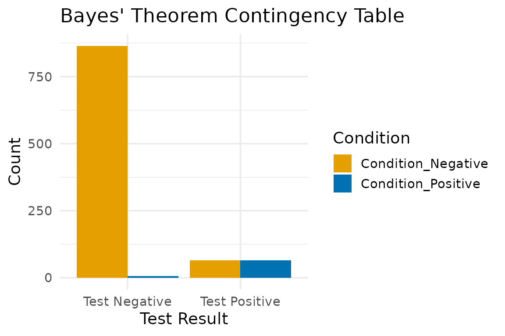
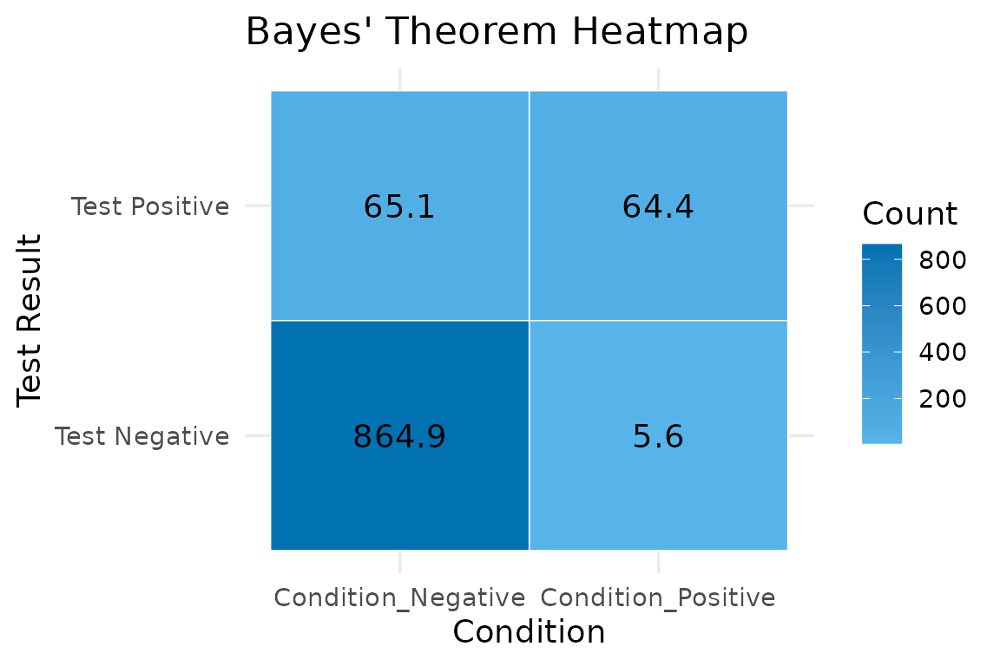
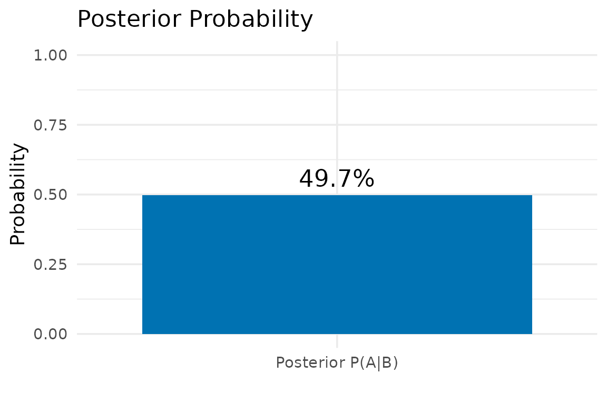

# Bayes’ Theorem Flu Test Example

## Overview

Bayes’ Theorem is a foundational concept in probability, statistics, and
machine learning. In healthcare analytics, it is frequently used to
update clinical risk estimates as new patient data becomes available.

This vignette walks through a realistic example using influenza testing
data to compute:

- the probability of having the flu given a positive test result
- a full 2×2 contingency table
- accessible visualizations generated by the bayes() function

## Flu Test Scenario

Public health data provide the following estimates:

- Prevalence of flu in the population: $`P(A) = 0.07`$
- Sensitivity of the flu test (true positive rate):
  $`P(B \mid A) = 0.92`$
- Specificity of the test: $`P(B^- \mid A^-) = 0.93`$, which implies a
  false positive rate of $`P(B \mid A^-) = 0.07`$

Given this detail, what is the probability of actually having the flu if
a patient tests positive?

## Using the bayes() Function

### Using the Function

``` r

result <- bayes(
  prevalence = 0.07,
  sensitivity = 0.92,
  false_positive = 0.07
)
```

### Posterior Probability

This value represents: $`P(A \mid B)`$, which is the probability of
having the flu given a positive test.

``` r

result$posterior_probability
```

    ## [1] 0.4973

### Contingency Table

This table shows the scaled counts (default population size = 1000):

- True Positives
- False Positives
- False Negatives
- True Negatives

``` r

result$contingency_table
```

    ##          Result Condition_Positive Condition_Negative  Total
    ## 1 Test Positive               64.4               65.1  129.5
    ## 2 Test Negative                5.6              864.9  870.5
    ## 3         Total               70.0              930.0 1000.0

### Visualizations

#### Grouped Bar Chart

``` r

result$barchart
```



#### Heatmap

``` r

result$heatmap
```



#### Posterior Probability Plot

``` r

result$posterior_plot
```



## Hand Calculation

Bayes’ Theorem calculations can be performed manually for the validation
of results:

*Given*

- $`P(A) = 0.07`$
- $`P(A^-) = 1 - P(A) = 0.93`$
- $`P(B \mid A) = 0.92`$
- $`P(B \mid A^-) = 0.07`$

*Compute the probability of a positive test*

- Calculate $`P(B)`$, which is the probability of a positive test,
  calculated using the Law of Total Probability
- Through Bayes’ Theorem, compute $`P(A \mid B)`$, which is the
  probability of having the flu given a positive test result

------------------------------------------------------------------------

## References

- Centers for Disease Control and Prevention. (n.d.). *Flu burden
  estimates and data visualization tools.*
  <https://www.cdc.gov/flu-burden/php/data-vis/index.htmlLinks> to an
  external site.
- Centers for Disease Control and Prevention. (2024, September 17).
  *Rapid influenza diagnostic tests.*
  <https://www.cdc.gov/flu/hcp/testing-methods/rapidclin.htmlLinks> to
  an external site.
- Centers for Disease Control and Prevention. Flu burden estimates and
  data visualization tools.
- Statista Research Department. (2026, April 23). *Total population of
  the United States from 2015 to 2024, with a forecast until 2031.*
  Statista.
  <https://www.statista.com/statistics/263762/total-population-of-the-united-states/Links>
  to an external site.
